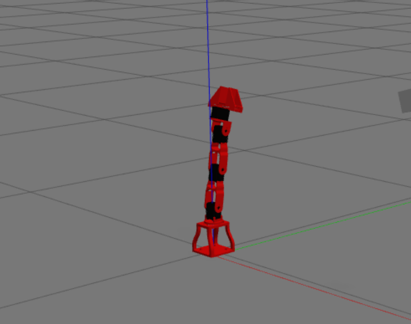

# Robotics Lab Homework 1

This repository contains a complete setup for simulating and controlling a robotic arm using ROS and Gazebo. The project includes URDF models, Gazebo integration, and a custom ROS node for joint control.

## Contents

1. **URDF Model and Rviz Visualization**
   - **arm_description**: Contains the URDF model of the robotic arm.
   - **Launch file**: `display.launch` to load and visualize the robot in Rviz.
   - **Collision Meshes**: Replaced with primitive shapes for efficient collision detection.
   - **Gazebo Integration**: Added Gazebo-specific tags to the URDF using Xacro.
  

  

2. **Gazebo Simulation**
   - **arm_gazebo**: Includes the launch file `arm_world.launch` to spawn the robot in a Gazebo world.
   - **Transmission and Controllers**: Configured transmission and controllers for joint control.
   - **Control Configuration**: `arm_control.launch` and `arm_control.yaml` to manage joint position controllers.

3. **Camera Sensor**
   - Added a camera sensor to the robot's URDF.
   - Configured the camera plugin in Gazebo and verified image publishing with `rqt_image_view`.

4. **Custom ROS Node**
   - **arm_controller**: A ROS C++ node to read joint states and send position commands.
   - **Functionality**: Publishes sinusoidal commands to actuate joints and prints joint states to the terminal.

  

